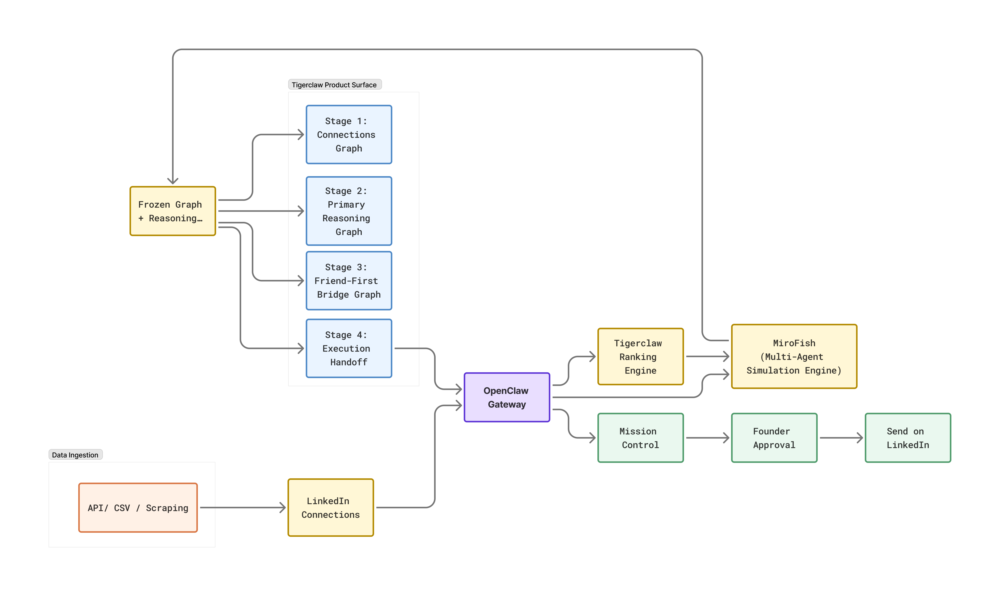
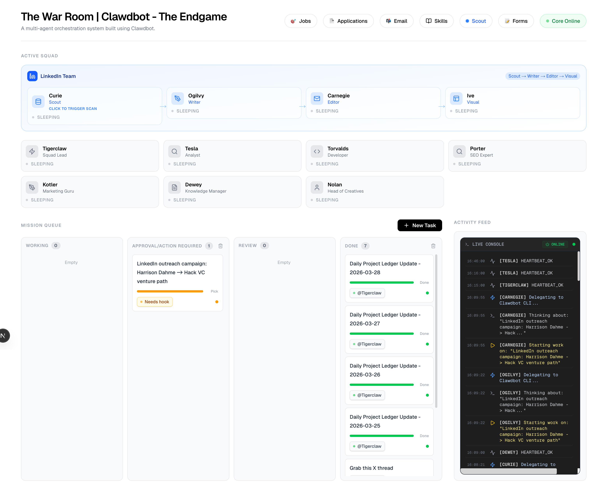

# Tigerclaw

Tigerclaw is a founder-facing outreach strategist for warm investor introductions.

It takes a founder's LinkedIn network, ranks the strongest routes, runs MiroFish as a side simulation engine to pressure-test those routes, and then hands the founder-selected path into Mission Control so downstream agents can build the final outreach campaign.

The Chrome extension in this repo is only the ingest sidecar. The product surface is the standalone Tigerclaw app.

## System Flow



## Video Walkthrough

[Watch the Tigerclaw walkthrough video (Tigerclaw.mov)](https://drive.google.com/file/d/1vt2GFYpb5KMCsoDfvRYgLAbClHCE2C6p/view?usp=sharing)

### What is happening

1. `API / CSV / Scraping` ingests LinkedIn data.
2. Tigerclaw normalizes that into the founder's LinkedIn connections.
3. `OpenClaw Gateway` acts as the central control plane between Tigerclaw, MiroFish, and Mission Control.
4. Tigerclaw ranks the warmest outreach routes from the founder's first-degree graph.
5. `MiroFish` runs on the side as a multi-agent simulation engine and evolves that ranked graph into reasoning artifacts.
6. Tigerclaw freezes those graph and reasoning outputs into the product surface:
   - Stage 1: Connections Graph
   - Stage 2: Primary Reasoning Graph
   - Stage 3: Friend-First Bridge Graph
   - Stage 4: Execution Handoff
7. The founder chooses between the final direct route and the friend-first bridge route.
8. Tigerclaw hands the selected route into `Mission Control`.
9. Mission Control runs the downstream workflow to build the final outreach campaign.
10. After founder approval, the final outreach can be sent on LinkedIn.

## Product Surfaces

### 1. Tigerclaw app

This is the main product.

It shows:

- the staged graph flow
- MiroFish reasoning replay
- route comparison and founder decision
- Mission Control handoff

Local route:

```text
dist/app.html
```

### 2. LinkedIn extension

This is not the product surface. It is just the ingest sidecar.

It is used for:

- LinkedIn session detection
- scraping self/profile/company/post analytics
- syncing first-degree connections
- exporting JSON/CSV snapshots
- uploading snapshots to Convex

Load from:

```text
dist/
```

### 3. MiroFish

MiroFish is used as the side simulation engine.

For the hackathon flow, the intended mode is:

- run MiroFish once
- capture the strongest graph outputs
- freeze them into Tigerclaw
- present the result cleanly in the Tigerclaw UI

### 4. Mission Control

Mission Control is the execution layer.

Tigerclaw hands the founder-selected route into Mission Control, where the downstream agents turn that route into the actual outreach package. Mission Control is where the selected path becomes a working campaign, moves through review, and waits for founder approval before the final LinkedIn send.

The current integration uses the LinkedIn workflow:

```text
Curie -> Ogilvy -> Carnegie -> Ive
```

#### Mission Control Dashboard



## Local Setup

```bash
npm install
npm run build
```

Open the standalone app from:

```text
dist/app.html
```

Load the unpacked extension from:

```text
dist/
```

## LinkedIn Ingest Workflow

1. Log into LinkedIn in the same Chrome profile.
2. Open the extension popup.
3. Run `Connect LinkedIn`.
4. Run `Read My Profile`.
5. Run `Scrape My Activity`.
6. Run `Sync Post Analytics`.
7. Run `Sync 1st-Degree Connections`.
8. Export JSON or CSV if needed.
9. Push the snapshot to Convex.

## Convex Setup

This repo includes a dedicated Convex backend under [`convex/`](./convex).

1. Create or choose a Convex deployment.
2. Run:

```bash
npm run convex:dev
```

3. Let Convex generate `convex/_generated`.
4. Set optional local defaults in `.env.extension.local`:
   - `TIGERCLAW_CONVEX_URL`
   - `TIGERCLAW_CONVEX_WORKSPACE_KEY`
   - `TIGERCLAW_CONVEX_SYNC_TOKEN`
   - `TIGERCLAW_CONVEX_LABEL`
5. Rebuild and reload the extension.

The extension pushes snapshots through:

- `linkedinSync:upsertInstallation`
- `linkedinSync:startSyncUpload`
- `linkedinSync:uploadConnectionBatch`
- `linkedinSync:completeSyncUpload`

## Notes

- This repo currently contains both the founder-facing Tigerclaw app and the LinkedIn ingest extension.
- Raw session material is kept in extension local storage and not shown in the popup.
- Convex uploads are chunked in batches of 100 connections.
- This is a prototype workflow built around private LinkedIn web endpoints and local hackathon orchestration, not a production-safe integration.
